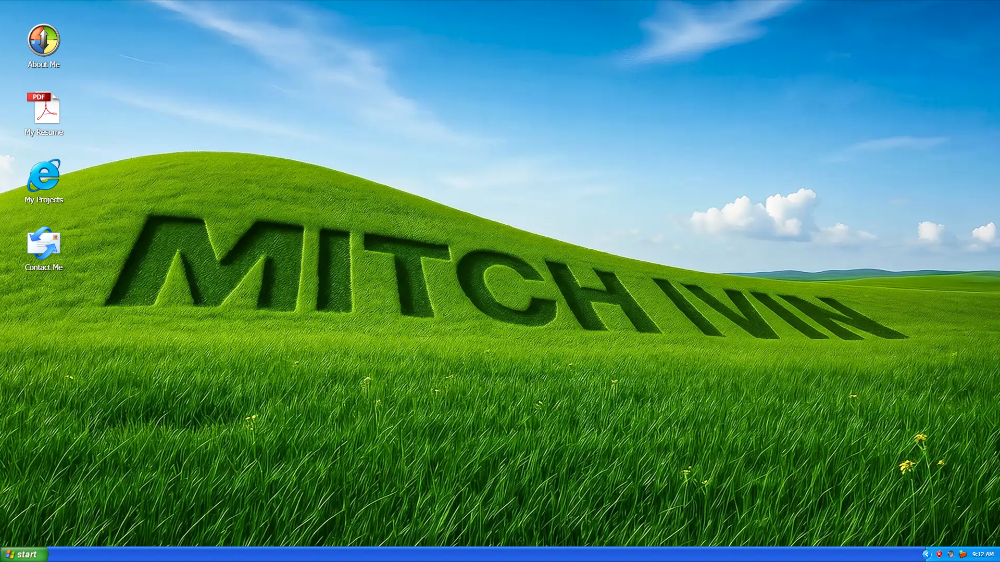
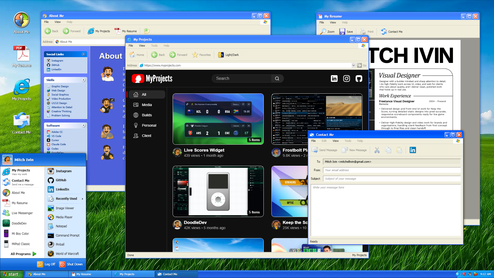

# MitchIvin XP

An interactive Windows XP desktop in your browser. Explore Mitch Ivin's work, play some music, and stay for a game.

**[Explore the desktop](https://mitchivin.com/)**

Works on desktop and phone. Open the site, log in, and dig around.

## A desktop to explore

- **A portfolio you can open.** Browse My Projects, learn about Mitch, view his resume, or get in touch from the desktop.
- **Music with a familiar face.** Listen with MiPod Classic or switch between Media Player's Headspace and Corona skins.
- **A little time to play.** Discover Mi Boy Color, Minesweeper and 3D Pinball, or revisit the World of Warcraft login screen.
- **More tucked into Start.** Chat with MitchBot in Live Messenger, draw in Paint, or jot something down in Notepad.
- **Make yourself at home.** Move windows, arrange shortcuts, and explore the menus. Keep the CRT effect on for nostalgia or turn it off for a clearer view.

## Get started

1. Open [mitchivin.com](https://mitchivin.com/) and select Mitch's login tile.
2. Double-click a desktop icon, or double-tap on your phone.
3. Open Start to find more programs. Right-click on desktop or long-press on phone for context menus.

Some programs are available on desktop only.

This repository contains public product information. The application source is not published here.

## Related

- [Mi Boy Color](https://github.com/mitchivin/miboy)
- [MiPod](https://github.com/mitchivin/mipod)

## Credits

Built by [Mitch Ivin](https://mitchivin.com/).

- [XP.css](https://botoxparty.github.io/XP.css/) by botoxparty
- [JS Paint](https://jspaint.app/) by Isaiah Odhner
- [WLMOnline](https://codepen.io/annarodrigues/) by Anna Rodrigues
- [WoWLoginScreens](https://github.com/Xiexe/WoWLoginScreens) by Xiexe
- [GameBoy-Online](https://github.com/taisel/GameBoy-Online) by Grant Galitz
- [98.js](https://98.js.org/) by 1j01
- [Minesweeper](https://github.com/ziebelje/minesweeper) by Jon Ziebell (desktop, via 98.js)
- [mines.vercel.app](https://mines.vercel.app/) by ShizukuIchi (mobile Minesweeper)
- [SpaceCadetPinball](https://github.com/k4zmu2a/SpaceCadetPinball) by k4zmu2a / Alula (3D Pinball for Windows - Space Cadet, via 98.js)

Game Boy and Game Boy Color trademarks belong to Nintendo. Windows XP imagery, sounds, and trademarks belong to Microsoft Corporation. World of Warcraft Vanilla imagery and audio belong to Blizzard Entertainment. Portfolio piece and parody, not an official product.

Screenshots captured at 1920×1080 with the CRT effect turned off.
